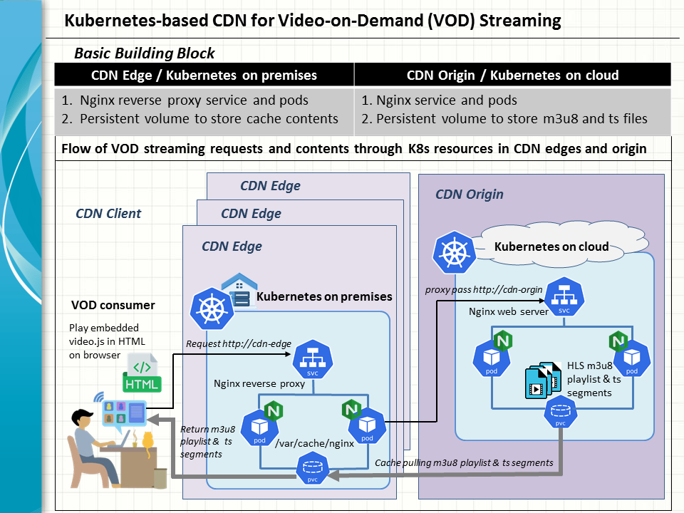

In this hands on exercise, we ilustrate how to set up a CDN building block on Kubenetes in a nifty use case of provisioning and delivering a vod stream from a sample media file.
1. Deploy a CDN origin based on Kubernetes on cloud
2. Provision video contents for streaming from the CDN origin
3. Deploy a CDN edge based on Kubernetes on premises

### 1. CDN origin on Kubernetes on cloud

We uses a Killercoda Kubernetes playground to simiate a Kubernetes cluster running on cloud.
Apply the manifest file nginx-hls.yaml from this repo to create the nginx pods and service for the CDN origin.
```
kubectl create -f https://raw.githubusercontent.com/snpsuen/Kubernetes_CDN_VOD_Streaming/refs/heads/main/artifact/nginx-hls.yaml
```
In this example, both the nginx pods and service are named nginx-hls to focus on the delivery of HLS streaming contents by the nginx web server.
```
controlplane:~$ kubectl get pods
NAME                         READY   STATUS    RESTARTS   AGE
nginx-hls-76457cdbdb-7tvld   1/1     Running   0          76s
nginx-hls-76457cdbdb-jktf6   1/1     Running   0          76s
controlplane:~$ kubectl get svc 
NAME         TYPE           CLUSTER-IP       EXTERNAL-IP   PORT(S)        AGE
kubernetes   ClusterIP      10.96.0.1        <none>        443/TCP        17d
nginx-hls    LoadBalancer   10.104.163.161   <pending>     80:30245/TCP   79s
```

The pods run on a customised nginx docker image, snpsuen/nginx-hls:v01 with two specific features or "toppings" baked in.

First, the ffmeg package is installed in order to provision the streaming contents of a given video media file.
```
apt intstall ffmeg
```

Furthermore a user defined nginx config file is put in place to specify how the nginx web server should run at the CDN origin. In parituclar, the server is configured to support the hosting of the MIME types for HLS streaming contents.
```
server {
    listen 8000;
    root /var/www/html;

    location /hls {
        add_header 'Access-Control-Allow-Origin' '*' always;
        root /var/www/html;   # put your HLS files in /var/www/html/hls
        types {
            application/vnd.apple.mpegurl m3u8;
            video/mp2t ts;
        }
        add_header 'Cache-Control' 'no-cache';
    }
}
```

### 2. Provision VOD streaming contents at the CDN origin

Imperative actions need to be taken in this step to inject the VOD data to the nginx servers. 
Suppose you have uploaded a given video media file to the Killercoda playgound. For example, let's refer to a mp4 file called Istio_ingessgateway_virtualservice_part01.mp4. Copy the file from a Kubernetes node to the web directory shared between the nginx-hls pods to store HLS streaming contents.
```
pod=`kubectl get pods -o jsonpath='{.items[?(@.metadata.labels.app=="nginx-hls")].metadata.name}' | head -1`
kubectl exec $pod -- mkdir /var/www/html/hls/v0001
kubectl cp Istio_ingressgateway_virtualservice_part01.mp4 $pod:/var/www/html/hls/v0001
```

Now we come to the important part of creating an HLS package of video streaming contents from the media file. To this end, the ffmeg command is invoked to break down the media file into HLS streaming segments.
```
kubectl exec $pod -- ffmpeg -i /var/www/html/hls/v0001/Istio_ingressgateway_virtualservice_part01.mp4 \
-codec:v libx264 -profile:v baseline -level 3.0 -s 640x360 -start_number 0 \
-hls_time 6 -hls_list_size 0 -f hls /var/www/html/hls/v0001/playlist.m3u8
```

Each segment is identified ordinally by a ts file, playlist<N>.ts, which contains 6 seconds of video contents. The segment files are summarised in a list in the text file playlist.m3u8.
```
kubectl exec $pod -- ls -al /var/www/html/hls/v0001                                                  
total 16060
drwxr-xr-x 2 root root     4096 Oct  7 00:17 .
drwxrwxrwx 3 root root     4096 Oct  7 00:15 ..
-rw-r--r-- 1 root root     1101 Oct  7 00:17 playlist.m3u8
-rw-r--r-- 1 root root   203604 Oct  7 00:16 playlist0.ts
-rw-r--r-- 1 root root   194204 Oct  7 00:16 playlist1.ts
:::
-rw-r--r-- 1 root root   194392 Oct  7 00:17 playlist29.ts
-rw-r--r-- 1 root root   123140 Oct  7 00:17 playlist30.ts
:::
kubectl exec $pod -- ls -al /var/www/html/hls/v0001 -- cat /var/www/html/hls/v0001/playlist.m3u8
#EXTM3U
#EXT-X-VERSION:3
#EXT-X-TARGETDURATION:10
#EXT-X-MEDIA-SEQUENCE:0
#EXTINF:10.000000,
playlist0.ts
#EXTINF:10.000000,
playlist1.ts
#EXTINF:10.000000,
:::
playlist30.ts
#EXT-X-ENDLIST
```
It is these ts files together with the m3u8 metadata that are instrumental in the implementation of video streaming as they are pulled continuously in sequence by the client video player via standard HTTP GET requests. Henceforth, they will be served out as static, read-only files by the nginx web server in response to any on-demand requests for the media item concerned.

Finally, create an HTML file and add it to the web server as a landing page.
```
cat > v0001.html <<EOF
<!DOCTYPE html>
<html>
<head>
  <link href="https://vjs.zencdn.net/8.23.3/video-js.css" rel="stylesheet" />
  <script src="https://vjs.zencdn.net/8.23.3/video.min.js"></script>
</head>
<body>
  <h1> VOD streaming example </h1>
  <video
    id="my-video"
    class="video-js vjs-default-skin"
    controls
    preload="auto"
    width="640"
    height="360"
    data-setup='{}'>
    <source src="/hls/v0001/playlist.m3u8" type="application/x-mpegURL">
  </video>
</body>
</html>
EOF

kubectl cp v0001.html $pod:/var/www/html/
```

The landing page will be launched by a client to start playing the provisioned video stream on a browser. A video player is embedded in the HTML file in the form of a JS script, video.js. The m3u8 playlist is to be fetched by the browser before videosjs proceeds to download and process the listed ts files in a stream.

What we are going to do next is specific to our current attempt to use a Killercoda playground to similate a cloud-based Kubernetes cluseter in this example. If deployed on a commercial cloud,  the kubernete service nginx-hls would be exposed by a load balancer in place to the Internet with a persistent hostname and port number 

In contrast, Killercoda uses an ephermeral, dynamic URL to expose the kubernete service to the Internet. This is done by forwarding any incoming requests targted at the ephermeral host to a designated port on one of Kubernetes nodes for NodePort access to the service.


Fill in the given NodePort number and take note of the ephermal URL of the return web page. In this case, it is https://d6a3b270f6a5-10-244-4-203-30245-spca.r.killercoda.com.


